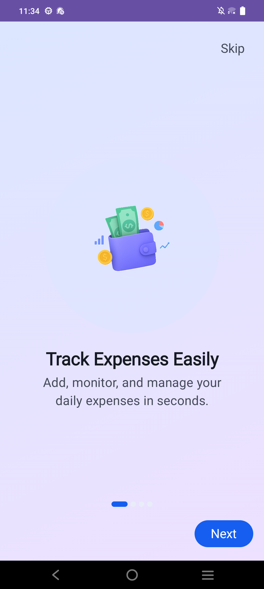
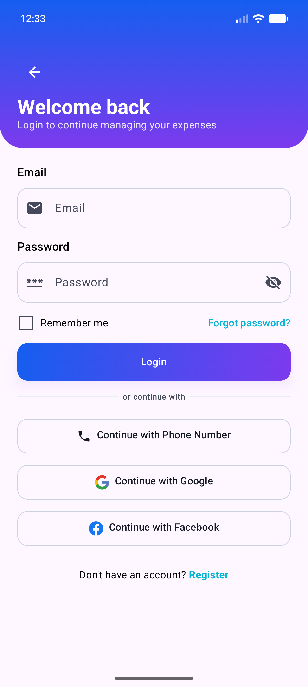
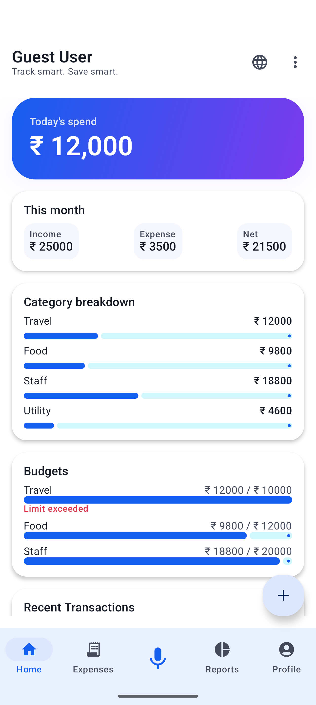
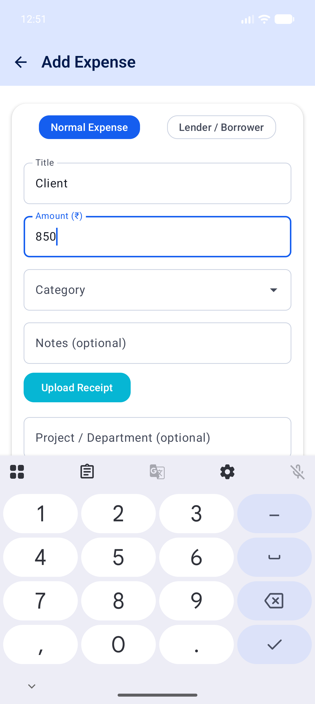
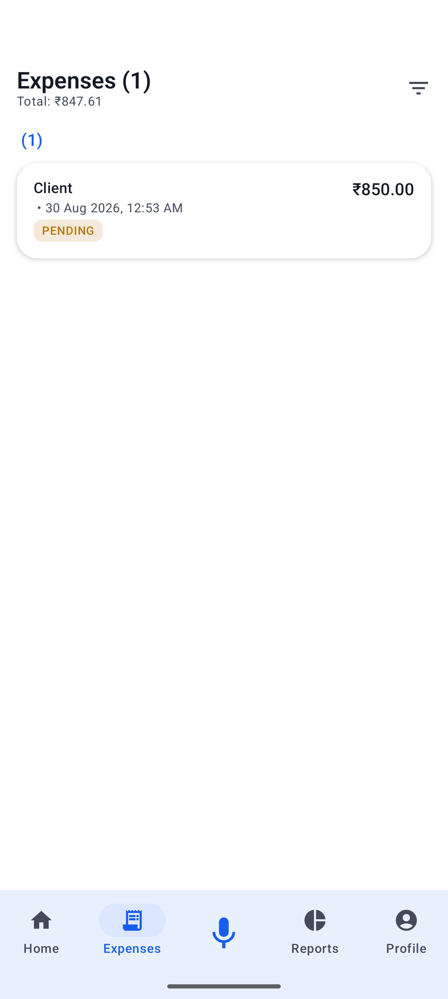
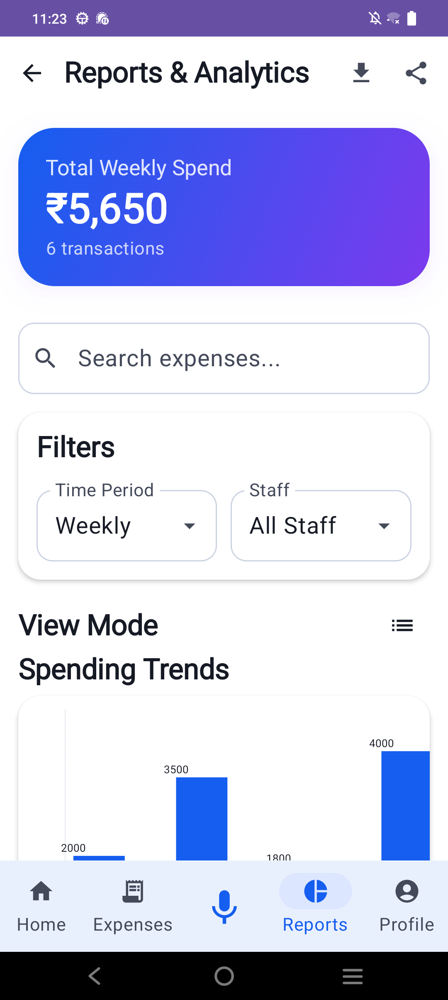
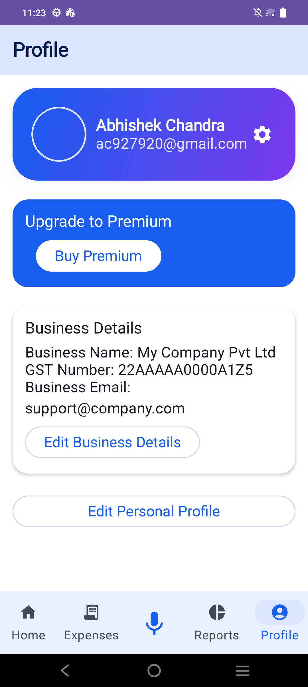
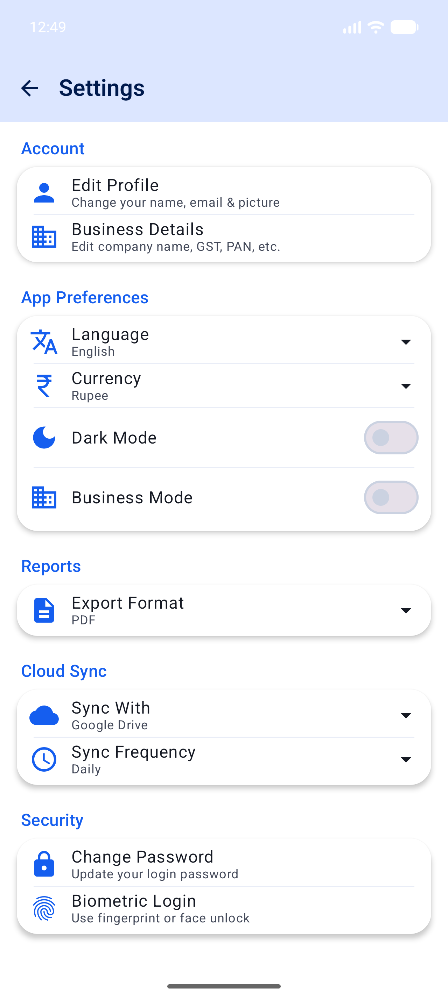
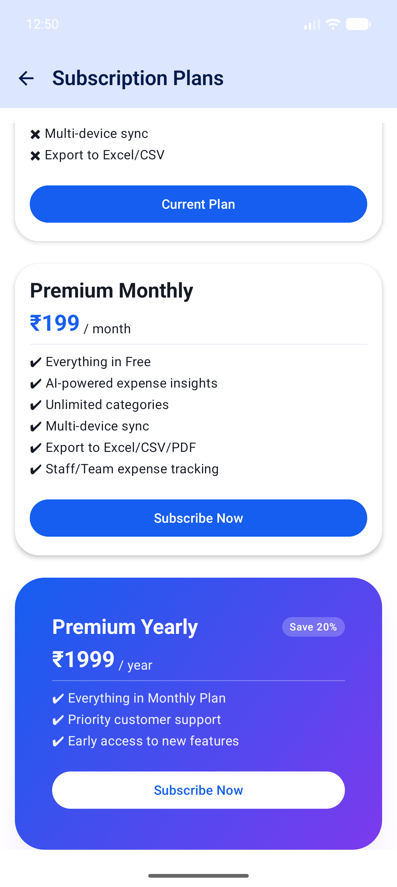

# Spendly

**By Abhishek Chandra**

Spendly is an Android expense tracker for individuals and small business
owners. It covers personal expense tracking, a business mode with staff
expense submission and admin/approver approval workflows, budget and
per-staff allocation tracking, and an informal lending/borrowing ledger for
money lent to or borrowed from contacts.

---

## Features

**Personal**
- Add expenses with title, amount, category, notes, and an optional receipt
  image
- Filter by today, yesterday, last 7 days, or all time; group by category or
  date
- Budgets with progress tracking and limit alerts
- A dashboard with today's spend, income vs. expense, and category
  breakdowns

**Business mode**
- Staff management with role-based access (Admin, Approver, Entry-only,
  Viewer)
- Expense submission and an admin/approver approval queue
- Budget allocations per staff member with usage tracking
- A staff spending leaderboard and per-staff dashboards

**Lending & borrowing**
- A contact-based ledger for money lent or borrowed, independent of regular
  expenses
- Repayment tracking with automatic status (pending / partial / paid)

**Reports & subscription**
- Spending trend charts, category breakdowns, and exportable reports
- Three tiers: Free, Premium Monthly (₹199/month), and Premium Yearly
  (₹1,999/year, ~20% off the monthly rate) — premium adds AI-powered
  insights, unlimited categories, multi-device sync, Excel/CSV/PDF export,
  and staff/team expense tracking

**Settings**
- Language (English/Hindi) and currency selection, dark mode, and a
  personal/business mode toggle
- Configurable export format (PDF/CSV/Excel) and cloud sync target
  (Google Drive/OneDrive/App Drive) with a sync frequency
- Change password and biometric login

---

## Tech stack

- **UI:** Jetpack Compose, Material 3 (custom theme system: per-flavor color
  schemes, a brand gradient, shared shape/spacing tokens, and a small motion
  library for screen transitions and micro-interactions)
- **Architecture:** MVVM with `StateFlow`, Hilt for dependency injection
- **Persistence:** Room (local database), DataStore (preferences)
- **Networking:** Ktor client (scaffolded for a future backend — see
  [docs/BACKEND_API_SPEC.md](docs/BACKEND_API_SPEC.md); the app is
  local-only today)
- **Async:** Kotlin Coroutines

---

## Project structure

```
app/src/main/java/com/abhishek/spendly/
├── core/            # DI modules, navigation graphs, DataStore, utils
├── data/            # Room entities/DAOs, repositories, domain models
└── ui/
    ├── components/  # Shared composables (buttons, cards, top bars, theme-aware widgets)
    ├── screens/     # One package per feature area (expense, home, staff, lender, ...)
    └── theme/       # Color schemes, typography, shapes, spacing, gradients, motion
```

---

## Getting started

Requires Android Studio (or the command line) with JDK 17–21. **Note:** if
your default JDK is newer than 23, Gradle 8.13 will fail to build — either
switch your `JAVA_HOME` to a JDK in that range or use Android Studio's
bundled JBR and confirm the project's Gradle JDK setting (`File > Project
Structure > SDK Location`, or `.idea/gradle.xml`) points to it.

```bash
./gradlew assembleDebug     # build a debug APK
./gradlew installDebug      # build and install on a connected device/emulator
./gradlew build             # full build: both variants, unit tests, lint
```

---

## Documentation

- [docs/BACKEND_API_SPEC.md](docs/BACKEND_API_SPEC.md) — data model and REST
  API spec for the backend this app doesn't have yet
- [docs/MARKET_RESEARCH.md](docs/MARKET_RESEARCH.md) — competitive
  landscape and monetization research for this product category
- [docs/DEVELOPMENT_PLAN.md](docs/DEVELOPMENT_PLAN.md) — phased plan for
  turning the above into a shipped product

---

## Screenshots

**Onboarding & login**

 

**Home & expenses**

  

**Reports, profile & settings**

  

**Subscription**



---

## License

MIT — see [LICENSE](LICENSE).
